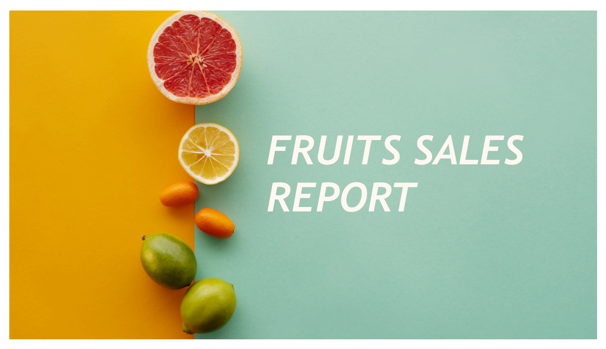
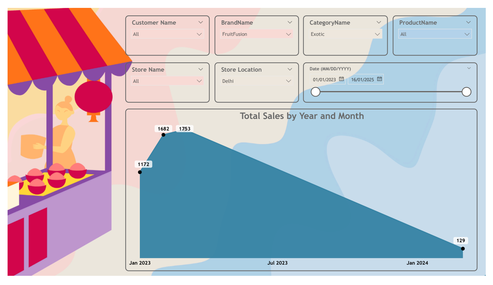
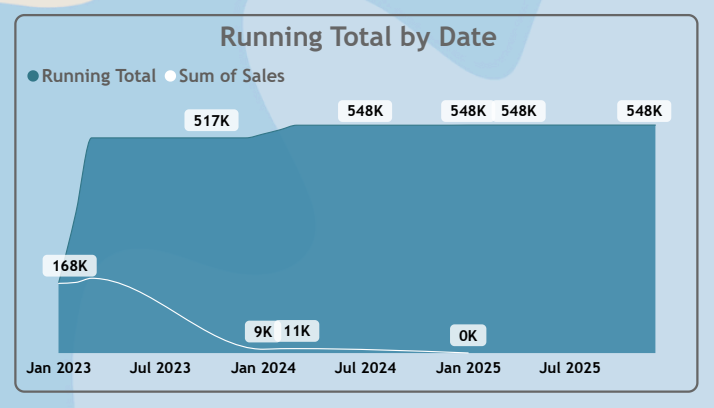
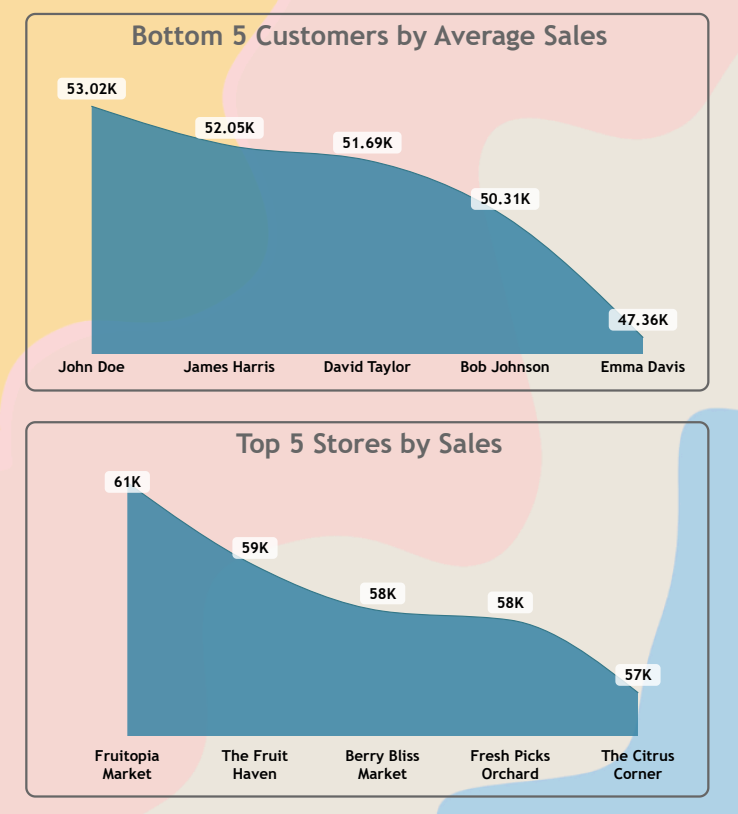
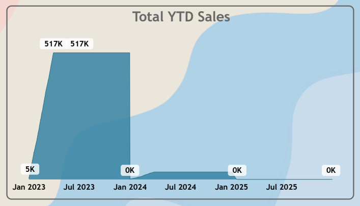

# Fruits Sales Data Analysis
Power BI | SQL | DAX | Data Modeling | Business Intelligence

## Project Summary
This project presents an end-to-end Fruits Sales Analysis solution built to help business stakeholders monitor sales performance, uncover trends, and optimize store- and customer-level decision-making.

The dashboard transforms raw sales data into actionable insights using Power BI, enabling data-driven decisions related to inventory planning, sales strategy, and performance monitoring.

The analysis is based on multi-year transactional sales data across customers, stores, products, and brands.

### Business Objectives
- Analyze total and average sales trends over time
- Identify top-performing stores and underperforming customers
- Track Year-to-Date (YTD) and Running Total sales
- Support demand forecasting and inventory optimization
- Enable interactive, self-service business analysis

### Tools & Technologies
- Power BI Desktop & Power BI Service
- Microsoft Excel (Cloud-based data source via OneDrive)
- Power Query (ETL & Data Transformation)
- DAX (Time Intelligence & KPI Measures)
- Snowflake Schema Data Modeling

### Data Source
- Excel dataset stored in Microsoft OneDrive
- Fact Table: Sales
- Dimension Tables: Customer, Store, Product, Category, Brand, Date

### Data Model
- Implemented a Snowflake Schema - chosen to improve query performance, scalability, and slicer responsiveness in Power BI.
- One-to-many relationships between fact and dimension tables
- Optimized for slicer interactions and report performance

### Dashboard Highlights
- Fully interactive slicers for Customer, Brand, Category, Store, Location, and Date
- Responsive slicer-driven analysis enabling non-technical users to explore insights independently
- KPI cards tracking Total Sales, Average Sales, YTD Sales, and Running Total
- Dynamic time-series analysis to identify monthly and yearly sales trends
- Top & bottom performer analysis to spotlight high-value stores and underperforming customers
- Drill-down enabled visuals for deeper performance investigation
- Clean, business-friendly dashboard layout optimized for executive review

### Key Metrics & Analysis
- Total Sales by Year & Month
- Average Sales per Customer
- Year-to-Date (YTD) Sales
- Running Total Sales
- Top 5 Stores by Sales
- Bottom 5 Customers by Average Sales

## How to Use the Dashboard
- Apply slicers to analyze sales performance by customer, store, product, and time period
- Compare sales trends across months and years to identify seasonality
- Identify top-performing stores and customers for strategic focus
- Detect underperforming segments for targeted promotions or sales improvement

## Dashboard Snapshots

### Sales Overview Dashboard

### Sales Trend Analysis (Year & Month)

### Running Total Sales Analysis

### Top Stores & Bottom Customers Analysis

### Year-to-Date (YTD) Sales Overview

### Key Insights
- Sales show seasonal patterns with peak performance in specific months
- A small group of top stores contributes a disproportionately high share of total revenue
- Bottom-performing customers present opportunities for targeted marketing
- Running total analysis highlights consistent long-term sales growth
- YTD analysis enables quick comparison across different years

### Business Impact
- Improves sales performance monitoring
- Supports inventory and demand planning
- Enables store-level and customer-level decision-making
- Provides stakeholders with a single source of truth for sales insights

### Outcome
Delivered a production-ready Power BI sales analytics solution that can be directly used by business teams for sales monitoring, planning, and performance reviews.

### Skills Demonstrated
- Data Analysis & Business Intelligence
- Power BI Dashboard Design
- SQL & Data Modeling
- DAX (Time Intelligence & KPIs)
- Analytical Storytelling
- Stakeholder-Oriented Reporting

## Data Ethics & Disclaimer
This project uses a synthetic or simulated sales dataset for educational and analytical purposes only.
It does not represent real company sales or customer data.

